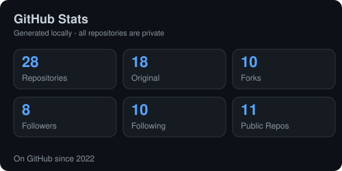
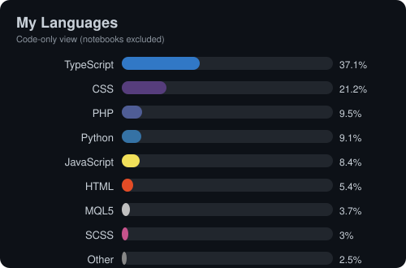

# Hi there, I'm Factix or known as Styx dY`<

I am an IT geek and Full Stack Developer based in Malaysia, with a strong focus on enterprise infrastructure and building optimized, lightweight web applications. I bridge the gap between backend system administration (firewalls, server infra, Exchange hybrid setups) and modern software engineering.

---

## 🚀 What I've Built

> A complete index of everything I've created across my GitHub — from enterprise SaaS platforms to monitoring tools, trading bots, and experimental AI projects. *(Private repos are listed with their public descriptions; forks are grouped separately below.)*

### 💼 Business & Enterprise Platforms
- **[COORA.my](https://github.com/Factix/coora)** — Enterprise Human Resource Management System built on a vanilla PHP MVC stack with a Single Page Application (SPA) architecture. `PHP`
- **[COORA Desktop](https://github.com/Factix/coora-desktop)** — Cross-platform desktop wrapper for the COORA HRMS, built with NeutralinoJS. `JavaScript` · *topics: hrms, hrms-app, neutralinojs*
- **[BURGembira](https://github.com/Factix/burgembira)** — Burger Business Management Platform. `TypeScript`
- **[Qianance](https://github.com/Factix/Qianance)** — 💼 A desktop Financial Management Suite. `TypeScript`
- **[Room-Pass](https://github.com/Factix/roompass)** — Family Day room assignment portal. `TypeScript`
- **[EquipLink](https://github.com/Factix/EquipLink)** — Equipment linking / management tool. `TypeScript`
- **[ForCyberCafe](https://github.com/Factix/ForCyberCafe)** — Homelab cyber cafe management system (4CC).
- **[web-template-dashboard](https://github.com/Factix/web-template-dashboard)** — Reusable dashboard UI template. `CSS`
- **[portfolio](https://github.com/Factix/portfolio)** — Personal portfolio website. `PHP`

### 📡 Monitoring & Infrastructure Tools
- **[NodeOps](https://github.com/Factix/NodeOps)** — Internal Website Health and Ping Monitoring application. `TypeScript`
- **[CadenSync](https://github.com/Factix/CadenSync)** — Client-Side Website Heartbeat Monitor. `JavaScript`

### 📈 Trading & Financial Systems
- **[LSTM-Trading](https://github.com/Factix/LSTM-Trading)** — AI Forex Robot (Modular, LSTM) with Discord Alerts. `Python`
- **[TraderInsight](https://github.com/Factix/TraderInsight)** — Trader insight & analysis notebooks. `Jupyter Notebook`
- **[Trade-VM](https://github.com/Factix/Trade-VM)** — Trading virtual-machine setup / environment.

### 🤖 AI, Computer Vision & Experiments
- **[AFFECTOMETRY](https://github.com/Factix/AFFECTOMETRY)** — Attendance system for students in KVK.
- **[fyp-2](https://github.com/Factix/fyp-2)** — Sistem pengimbas muka untuk merekod kehadiran (face-scan attendance).
- **[python-app](https://github.com/Factix/python-app)** — Testing facial recognition for attendance logging.

### ⚙️ This Profile
- **[Factix/Factix](https://github.com/Factix/Factix)** — Config files for my GitHub profile. *topics: config, github-config*

---

## 🔭 Forked & Exploring

Repositories I've forked to study, contribute to, or tinker with:

| Repository | Language | What it is |
|------------|----------|------------|
| [fcc](https://github.com/Factix/fcc) | Python | Use claude-code free in terminal / VSCode / Discord |
| [localsend](https://github.com/Factix/localsend) | Dart | Open-source cross-platform alternative to AirDrop |
| [erpnext](https://github.com/Factix/erpnext) | Python | Free & open-source ERP |
| [Deep-Live-Cam](https://github.com/Factix/Deep-Live-Cam) | Python | Real-time face swap & one-click deepfake |
| [penpot](https://github.com/Factix/penpot) | Clojure | Open-source design & code collaboration tool |
| [UTM](https://github.com/Factix/UTM) | Swift | Virtual machines for iOS and macOS |
| [open-saas](https://github.com/Factix/open-saas) | TypeScript | Production-ready SaaS app starter for React & Node.js |
| [blockchain-in-js](https://github.com/Factix/blockchain-in-js) | JavaScript | Build your own blockchain |
| [awesome-library](https://github.com/Factix/awesome-library) | — | Curated awesome lists on interesting topics |
| [awesome-diy-software](https://github.com/Factix/awesome-diy-software) | — | Curated list of awesome DIY software |

---

## 🛠 Tech Stack & Tools

**Languages & Frameworks:**

**Database & Infrastructure:**

**Concepts & Architecture:**
`MVC Architecture` `Single Page Applications (SPA)` `RESTful APIs` `Role-Based Access Control (RBAC)` `Database Design` `Web Security (CSRF, PDO)` `NeutralinoJS` `Desktop Apps`

---

## 🎣 Outside of Code

When I step away from the server racks and code editors, you can usually find me:
* **Angling:** Exploring saltwater fishing spots across Malaysia.
* **Gaming:** Firing up the PS5 for competitive racing simulators like *Gran Turismo 7* and *F1*, or diving into classic retro strategy games like *Red Alert 2*.
* **Self-Studying:** Reading up on legal concepts and financial structures (like Islamic banking mechanics and Financial Trade system) for personal knowledge and protection.

---

## 📫 Let's Connect

<!---->

---

## 📊 GitHub Stats

  
  

  

---

> *From building robust infrastructure to crafting clean code, I'm always looking to solve complex problems with elegant solutions.*
